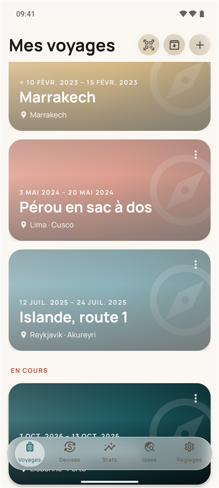
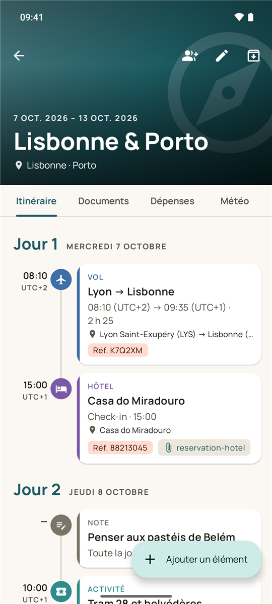
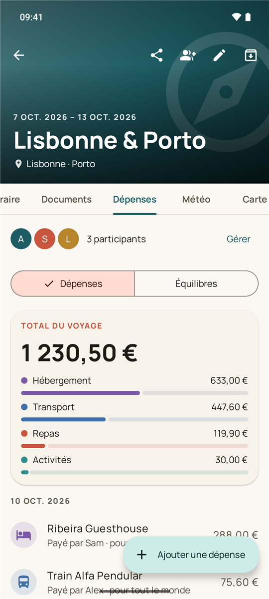
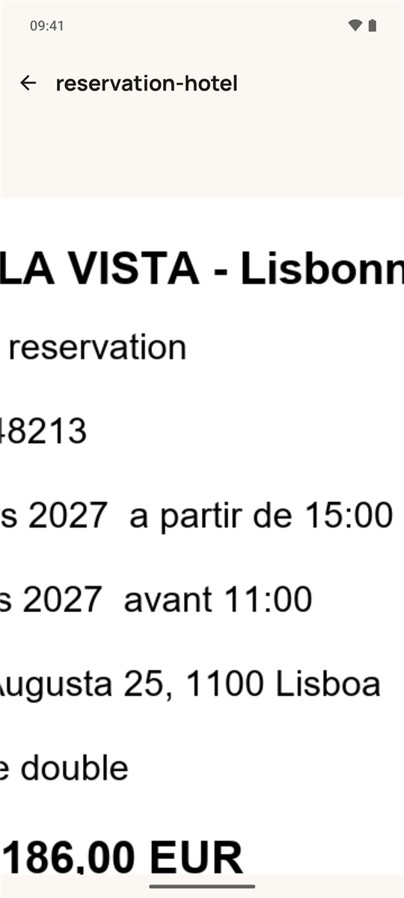
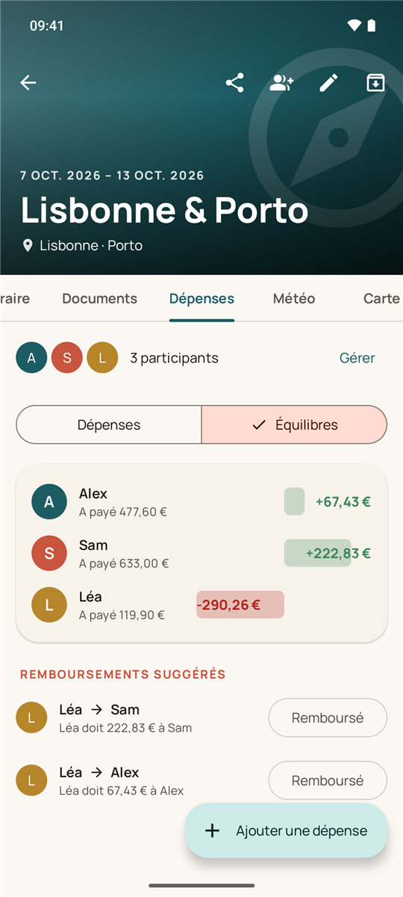
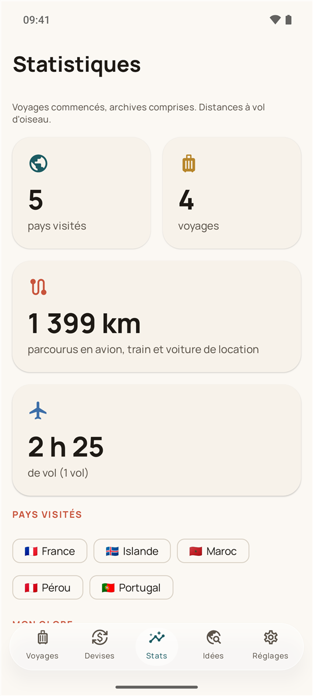
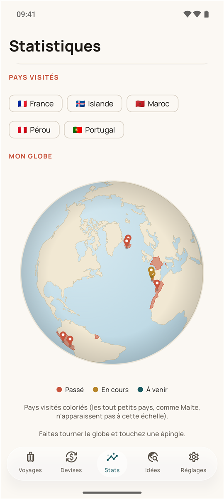
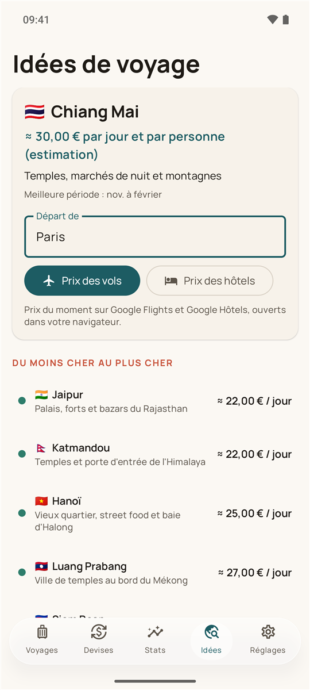

# Voyago

**Votre carnet de voyage sur Android** : itinéraire jour par jour, réservations et documents au même endroit, dépenses
partagées entre amis, et voyages que l'on prépare à plusieurs. Fonctionne hors connexion.

  
  
  

> Les captures montrent des voyages fictifs de démonstration.

## Ce que fait Voyago

### 🗓️ Un itinéraire clair, jour par jour
Vols, trains, hôtels, locations de voiture, taxis, restaurants, activités et notes, rangés par jour. Les heures
s'affichent dans le fuseau de chaque lieu (un vol Lyon → Tokyo indique l'heure de départ à Lyon et l'heure d'arrivée
à Tokyo), avec la durée réelle du trajet.

### 📎 Vos réservations et documents toujours sous la main
Billets, factures, passeports : les documents sont **chiffrés sur le téléphone** et joints aux éléments de l'itinéraire.
Un appui sur le trombone ouvre la pièce jointe, et on **zoome** pour lire un numéro de réservation ou un QR code.

Ajoutez une photo de facture, une capture d'écran ou un PDF : Voyago **remplit les champs tout seul** (dates, lieux,
référence, prix) sans écraser ce que vous avez déjà saisi.

### 💶 Les comptes entre amis, façon Tricount
Dépenses dans toutes les devises, converties au cours du jour, totaux par catégorie, qui a payé quoi pour qui, et
remboursements suggérés pour équilibrer les comptes en un minimum de virements.

### 👨‍👩‍👧 Des voyages partagés
Invitez vos compagnons de voyage avec un lien ou un QR code : tout le monde voit et complète le même itinéraire,
avec une notification quand quelqu'un ajoute une réservation ou un document. Les documents partagés restent chiffrés
de bout en bout.

### 🌍 Vos voyages en souvenirs
Statistiques (pays visités, kilomètres, heures de vol) et un **globe à faire tourner** avec une épingle par destination
et les pays visités coloriés.

### 💡 Des idées pour partir
Des destinations où l'on voyage pour pas cher, avec un budget indicatif par jour, et un accès direct aux **prix du moment**
des vols et des hôtels depuis votre ville de départ.

### Et aussi
- Rappels : enregistrement en ligne la veille d'un vol, départ de l'hôtel.
- Widget « Prochain voyage » pour l'écran d'accueil.
- Météo des destinations, carte de l'itinéraire, convertisseur de devises.
- Sauvegarde et restauration de tous vos voyages dans un fichier.

## En images

| Pièce jointe zoomée | Comptes entre amis | Statistiques |
|:---:|:---:|:---:|
|  |  |  |

| Globe des voyages | Idées de destinations |
|:---:|:---:|
|  |  |

## Installer

1. Sur un téléphone Android (8 ou plus récent), ouvrez la
   [dernière version](https://github.com/Jonathanmx5/voyago-app/releases/latest) et téléchargez **voyago.apk**.
2. Ouvrez le fichier : Android demande d'autoriser le navigateur à installer des applications, acceptez.
3. Ouvrez Voyago et connectez-vous avec votre compte Google.

Voyago n'est pas encore publiée sur le Play Store.

## Mettre à jour

Un point rouge apparaît sur **Réglages** quand une nouvelle version est disponible : **Réglages › Mises à jour ›
Mettre à jour**. La nouvelle version s'installe par-dessus l'ancienne ; vos voyages sont conservés.

## Vie privée

- Vos voyages restent sur votre téléphone ; seuls les voyages que vous partagez sont synchronisés avec les membres invités.
- Les documents sont chiffrés sur l'appareil, et de bout en bout dans les voyages partagés.
- La lecture automatique d'un document l'envoie à Google (Gemini) : l'application vous le demande avant le premier envoi.

---

Ce dépôt ne contient que les versions à installer ; le code source est privé.
